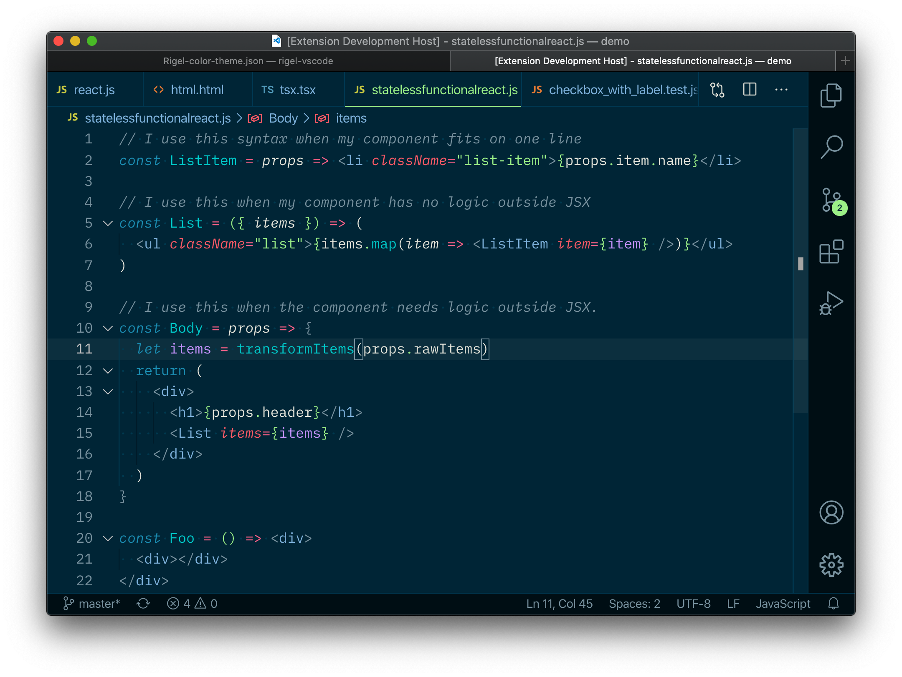
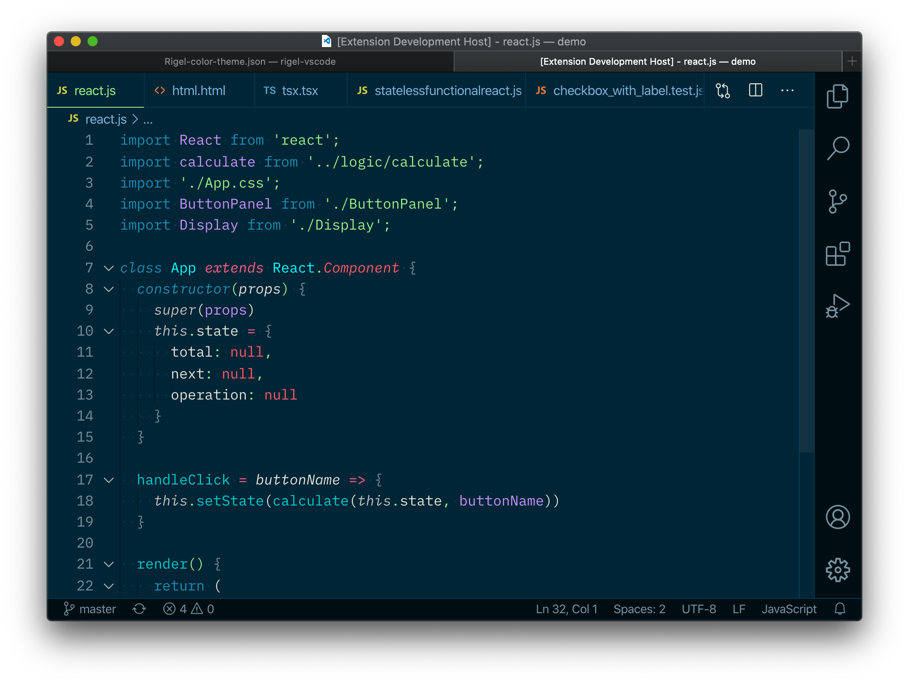
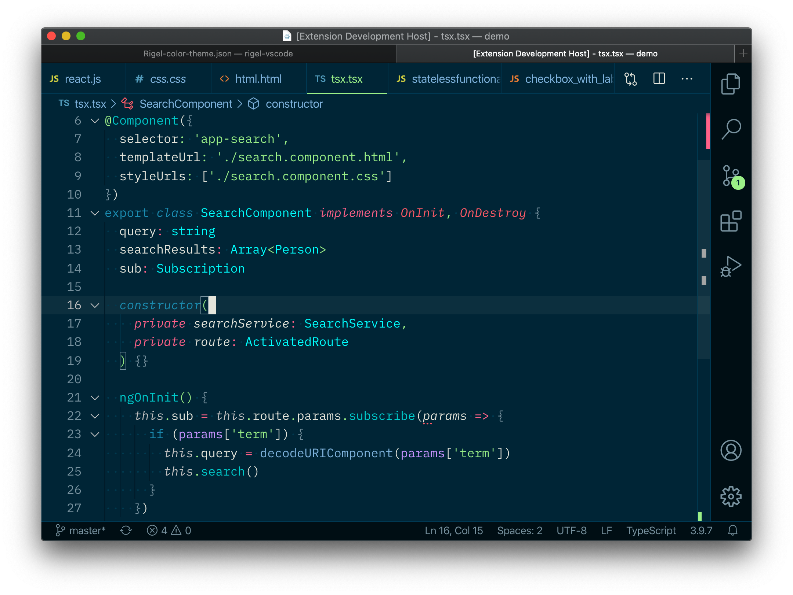

  

  <h1>Rigel theme for VS Code</h1>

  

    
    
    
    
    
    
  

  

    <a href="#features">Features</a> •
    <a href="#Installation">Installation</a> • <a href="#usage">Usage</a> •
    <a href="https://code-notes-example.netlify.com/">Demo</a>
  

### This is a port of the [Rigel theme](https://rigel.netlify.app/) for VS Code.

#### React

##### React (class component)

#### CSS

#### Angular TSX

#### JSON

#### Python

#### Ruby

#### PHP

---

## License

[MIT](https://choosealicense.com/licenses/mit/) © [Zander Martineau](https://zander.wtf)

> Made by Zander • [zander.wtf](https://zander.wtf) • [GitHub](https://github.com/mrmartineau/) • [Twitter](https://twitter.com/mrmartineau/)
